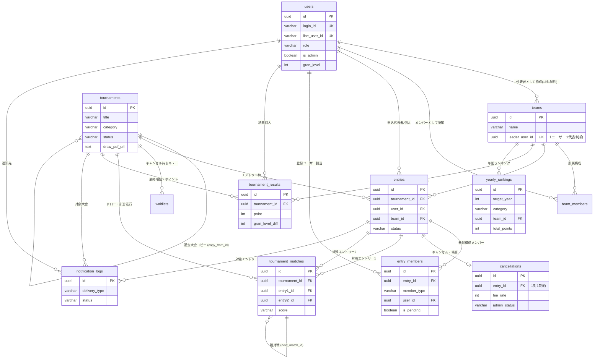

# データベース定義書 (Database Specification)
## 1. ER図 (Mermaid)



---

## 2. ENUM（列挙型）定義一覧

データ整合性の担保とストレージ容量削減のため、主要なステータス・区分には PostgreSQL のカスタム ENUM 型を採用します。

```sql
-- ユーザー権限（4段階ステータス）
CREATE TYPE user_role_enum AS ENUM (
    'ADMIN',       -- 管理者
    'OPERATOR',    -- 運営者
    'LEADER',      -- 代表者
    'USER'         -- ユーザー（一般）
);

-- 性別
CREATE TYPE gender_enum AS ENUM ('MALE', 'FEMALE', 'OTHER');

-- アカウントステータス
CREATE TYPE account_status_enum AS ENUM ('ACTIVE', 'SUSPENDED', 'PROVISIONAL');

-- 大会種別・部門
CREATE TYPE tournament_category_enum AS ENUM (
    'MEN_TEAM',    -- 男子団体戦
    'WOMEN_TEAM',  -- 女子団体戦
    'MIX_TEAM',    -- ミックス団体戦
    'SINGLES',     -- シングルス
    'DOUBLES'      -- ダブルス
);

-- 大会ステータス
CREATE TYPE tournament_status_enum AS ENUM (
    'DRAFT',       -- 未公開
    'UPCOMING',    -- 受付前
    'OPEN',        -- 受付中
    'CLOSED',      -- 締め切り
    'FINISHED',    -- 終了
    'CANCELLED'    -- 中止
);

-- エントリーステータス
CREATE TYPE entry_status_enum AS ENUM (
    'CONFIRMED',   -- 確定
    'WAITING',     -- キャンセル待ち
    'CANCELLED',   -- キャンセル済
    'ATTENDED'     -- 大会参加完了
);

-- エントリーメンバー種別
CREATE TYPE member_type_enum AS ENUM (
    'REGISTERED',  -- アプリ登録ユーザー
    'GUEST',       -- ゲスト枠
    'PENDING'      -- 未定枠
);

-- キャンセル待ちステータス
CREATE TYPE waitlist_status_enum AS ENUM (
    'WAITING',     -- 待機中
    'OFFERED',     -- 繰り上がり案内中
    'ACCEPTED',    -- 承諾済（エントリーへ昇格）
    'DECLINED',    -- 辞退
    'EXPIRED'      -- 期限切れ
);

-- 管理者キャンセル対応ステータス
CREATE TYPE cancellation_admin_status_enum AS ENUM (
    'NOT_REQUIRED',     -- 対応不要（無料キャンセル）
    'UNCONTACTED',      -- 未連絡
    'IN_CONSULTATION',  -- 相談中
    'PAID_CONFIRMED',   -- 入金確認済
    'WAIVED'            -- 免除
);

-- 大会結果・成績区分
CREATE TYPE result_rank_enum AS ENUM (
    'PARTICIPATED',     -- 参加（予選敗退等）: 1pt
    'L2_WINNER',        -- 2位トーナメント優勝: 2pt
    'T1_RUNNER_UP',     -- 1位トーナメント準優勝: 2pt
    'T1_WINNER'         -- 1位トーナメント優勝: 3pt
);

-- LINE通知配信種別
CREATE TYPE notification_type_enum AS ENUM (
    'ENTRY_CONFIRMED',     -- エントリー完了
    'CANCEL_FREE',         -- 無料キャンセル完了
    'CANCEL_PAID_USER',    -- 有償キャンセル案内（ユーザー向け）
    'CANCEL_PAID_ADMIN',   -- 有償キャンセル通知（管理者向け）
    'WAITLIST_OFFER',      -- 繰り上がり承諾案内
    'REMINDER_10DAYS',     -- 10日前メンバー未定督促
    'CAPACITY_ALERT',      -- 定員到達 / 1ヶ月前未達アラート
    'URGENT_BROADCAST'     -- 当日緊急一斉連絡
);

```

---

## 3. テーブル定義書

### 3.1 users（ユーザー・認証・プロフィール・権限）

ユーザーの基本情報、認証情報、権限、GRANレベルを管理します。

| 論理名 | 物理名 | データ型 | NULL | キー | 初期値 / 備考 |
| --- | --- | --- | --- | --- | --- |
| ユーザーID | `id` | UUID | NO | PK | `gen_random_uuid()` |
| ログインID | `login_id` | VARCHAR(32) | NO | UK | 自動採番または手動入力（一意制約）

 |
| パスワードハッシュ | `password_hash` | CHAR(60) | NO | - | bcryptハッシュ値

 |
| LINE User ID | `line_user_id` | CHAR(33) | YES | UK | LIFF連携用識別子（ローカル登録時はNULL）

 |
| LINE表示名 | `line_display_name` | VARCHAR(64) | YES | - | LINEの登録名

 |
| アカウント権限 | `role` | user_role_enum | NO | - | 初期値: `USER`（ADMIN/OPERATOR/LEADER/USER） |
| 管理者フラグ | `is_admin` | BOOLEAN | NO | - | 初期値: `false`（管理者画面認証用）

 |
| アカウント状態 | `status` | account_status_enum | NO | - | 初期値: `ACTIVE`<br> |
| 初回ログイン完了フラグ | `is_initial_login` | BOOLEAN | NO | - | 初期値: `false`（仮PW変更でtrue）

 |
| 氏名（本名） | `real_name` | VARCHAR(40) | NO | - | 管理用本名

 |
| フリガナ | `kana_name` | VARCHAR(40) | NO | - | フリガナ

 |
| ニックネーム | `nickname` | VARCHAR(40) | NO | - | デフォルト全体公開名

 |
| アイコン画像URL | `avatar_url` | TEXT | YES | - | ユーザーアバター画像パス

 |
| 性別 | `gender` | gender_enum | YES | - | MALE / FEMALE / OTHER

 |
| 生年月日 | `birth_date` | DATE | YES | - | 生年月日

 |
| 電話番号 | `phone_number` | VARCHAR(15) | YES | - | 連絡先電話番号

 |
| GRANレベル | `gran_level` | SMALLINT | NO | - | 初期値: `500`（3桁の整数値: 100〜999）

 |
| 最終ログイン日時 | `last_login_at` | TIMESTAMPTZ | YES | - | 最終アクセス日時

 |
| 作成日時 | `created_at` | TIMESTAMPTZ | NO | - | `CURRENT_TIMESTAMP`<br> |
| 更新日時 | `updated_at` | TIMESTAMPTZ | NO | - | `CURRENT_TIMESTAMP`<br> |

---

### 3.2 teams（チーム基本情報）

団体戦・ダブルスのエントリー母体となるチーム情報です。

| 論理名 | 物理名 | データ型 | NULL | キー | 初期値 / 備考 |
| --- | --- | --- | --- | --- | --- |
| チームID | `id` | UUID | NO | PK | `gen_random_uuid()`<br> |
| チーム名 | `name` | VARCHAR(60) | NO | - | チーム名称

 |
| アイコン画像URL | `avatar_url` | TEXT | YES | - | チームアイコン画像パス

 |
| 代表者ユーザーID | `leader_user_id` | UUID | NO | UK, FK | `users(id)` 参照。**UNIQUE制約で1人1チーム代表をDB保証**<br> |
| 作成日時 | `created_at` | TIMESTAMPTZ | NO | - | `CURRENT_TIMESTAMP`<br> |
| 更新日時 | `updated_at` | TIMESTAMPTZ | NO | - | `CURRENT_TIMESTAMP`<br> |

---

### 3.3 team_members（チーム所属メンバー構成）

一般メンバーの所属関係を管理します（複数チームへの所属可能）。

| 論理名 | 物理名 | データ型 | NULL | キー | 初期値 / 備考 |
| --- | --- | --- | --- | --- | --- |
| 所属ID | `id` | UUID | NO | PK | `gen_random_uuid()`<br> |
| チームID | `team_id` | UUID | NO | FK | `teams(id)` 参照（CASCADE削除）

 |
| ユーザーID | `user_id` | UUID | NO | FK | `users(id)` 参照

 |
| 所属登録日時 | `joined_at` | TIMESTAMPTZ | NO | - | `CURRENT_TIMESTAMP`<br> |
| *複合一意制約* | - | - | - | UK | `(team_id, user_id)` の重複登録を防止

 |

---

### 3.4 tournaments（大会要項・管理情報・ドロー連携）

大会の要項、募集設定、ドローPDFの管理情報です。

| 論理名 | 物理名 | データ型 | NULL | キー | 初期値 / 備考 |
| --- | --- | --- | --- | --- | --- |
| 大会ID | `id` | UUID | NO | PK | `gen_random_uuid()`<br> |
| 大会名 | `title` | VARCHAR(100) | NO | - | 大会名称

 |
| 種目区分 | `category` | tournament_category_enum | NO | - | 男子団体/女子団体/ミックス団体/単/複

 |
| 開催日 | `event_date` | DATE | NO | - | 大会開催日

 |
| 開始時刻 | `start_time` | TIME | NO | - | 試合開始予定時刻

 |
| 終了時刻 | `end_time` | TIME | YES | - | 終了予定時刻

 |
| 会場名 / コート情報 | `venue` | VARCHAR(120) | NO | - | 開催場所

 |
| 要項画像URL | `image_url` | TEXT | YES | - | 要項ポスター等の画像パス |
| 大会要項・詳細テキスト | `description` | TEXT | YES | - | 詳細説明、注意事項等

 |
| 募集定員枠数 | `capacity` | SMALLINT | NO | - | チーム数または人数枠

 |
| エントリー料金 | `entry_fee` | INT | NO | - | 参加費用（円単位）

 |
| 受付ステータス | `status` | tournament_status_enum | NO | - | 初期値: `DRAFT`<br> |
| 受付開始日時 | `entry_start_at` | TIMESTAMPTZ | NO | - | 受付開始日時

 |
| 受付締切日時 | `entry_end_at` | TIMESTAMPTZ | NO | - | 受付締切日時

 |
| 複製元大会ID | `copy_from_id` | UUID | YES | FK | `tournaments(id)` 参照（大会コピー用）

 |
| 1ヶ月前アラート閾値 | `alert_threshold` | SMALLINT | YES | - | 開催1ヶ月前の最低目標枠数

 |
| ドロー表PDF URL | `draw_pdf_url` | TEXT | YES | - | 管理者が出力したドロー表PDFのパス |
| 作成日時 | `created_at` | TIMESTAMPTZ | NO | - | `CURRENT_TIMESTAMP`<br> |
| 更新日時 | `updated_at` | TIMESTAMPTZ | NO | - | `CURRENT_TIMESTAMP`<br> |

---

### 3.5 entries（大会エントリー基本情報）

大会への申込データ本体です。

| 論理名 | 物理名 | データ型 | NULL | キー | 初期値 / 備考 |
| --- | --- | --- | --- | --- | --- |
| エントリーID | `id` | UUID | NO | PK | `gen_random_uuid()`<br> |
| 大会ID | `tournament_id` | UUID | NO | FK | `tournaments(id)` 参照

 |
| 申込者ユーザーID | `user_id` | UUID | NO | FK | `users(id)` 参照（代表者または個人）

 |
| エントリーチームID | `team_id` | UUID | YES | FK | `teams(id)` 参照（団体戦/複のみ必須）

 |
| 種目区分 | `category` | tournament_category_enum | NO | - | 申込時点の種目区分

 |
| エントリー状態 | `status` | entry_status_enum | NO | - | 初期値: `CONFIRMED`<br> |
| 代理登録フラグ | `is_proxy` | BOOLEAN | NO | - | 初期値: `false`（管理者代行時 true）

 |
| 申込日時 | `applied_at` | TIMESTAMPTZ | NO | - | `CURRENT_TIMESTAMP`<br> |
| 作成日時 | `created_at` | TIMESTAMPTZ | NO | - | `CURRENT_TIMESTAMP`<br> |
| 更新日時 | `updated_at` | TIMESTAMPTZ | NO | - | `CURRENT_TIMESTAMP`<br> |

---

### 3.6 entry_members（エントリー参加メンバー構成）

登録ユーザー、ゲスト、未定枠を正規化して管理します。

| 論理名 | 物理名 | データ型 | NULL | キー | 初期値 / 備考 |
| --- | --- | --- | --- | --- | --- |
| 構成メンバーID | `id` | UUID | NO | PK | `gen_random_uuid()`<br> |
| エントリーID | `entry_id` | UUID | NO | FK | `entries(id)` 参照（CASCADE削除）

 |
| メンバー種別 | `member_type` | member_type_enum | NO | - | REGISTERED / GUEST / PENDING

 |
| ユーザーID | `user_id` | UUID | YES | FK | `users(id)` 参照（REGISTERED時のみ）

 |
| ゲスト氏名 | `guest_name` | VARCHAR(40) | YES | - | GUEST時に入力

 |
| 未定フラグ | `is_pending` | BOOLEAN | NO | - | 初期値: `false`（10日前リマインド抽出用）

 |
| 出場順 / オーダー | `order_no` | SMALLINT | NO | - | 1, 2, 3...（第1ペアや登録順）

 |
| 作成日時 | `created_at` | TIMESTAMPTZ | NO | - | `CURRENT_TIMESTAMP`<br> |
| 更新日時 | `updated_at` | TIMESTAMPTZ | NO | - | `CURRENT_TIMESTAMP`<br> |

---

### 3.7 waitlists（キャンセル待ちキュー管理）

満員時の順番待ちおよび繰り上がり状態を管理します。

| 論理名 | 物理名 | データ型 | NULL | キー | 初期値 / 備考 |
| --- | --- | --- | --- | --- | --- |
| キャンセル待ちID | `id` | UUID | NO | PK | `gen_random_uuid()`<br> |
| 大会ID | `tournament_id` | UUID | NO | FK | `tournaments(id)` 参照

 |
| 申込者ユーザーID | `user_id` | UUID | NO | FK | `users(id)` 参照

 |
| チームID | `team_id` | UUID | YES | FK | `teams(id)` 参照

 |
| キャンセル待ち順位 | `queue_number` | SMALLINT | NO | - | 申込順の連番（1, 2, 3...）

 |
| ステータス | `status` | waitlist_status_enum | NO | - | 初期値: `WAITING`<br> |
| 繰り上がり通知日時 | `offered_at` | TIMESTAMPTZ | YES | - | LINE通知送信時刻

 |
| 承諾期限日時 | `accept_deadline` | TIMESTAMPTZ | YES | - | 承諾有効期限

 |
| 作成日時 | `created_at` | TIMESTAMPTZ | NO | - | `CURRENT_TIMESTAMP`<br> |
| 更新日時 | `updated_at` | TIMESTAMPTZ | NO | - | `CURRENT_TIMESTAMP`<br> |

---

### 3.8 cancellations（キャンセル・精算管理）

日数判定に応じたキャンセル料率と管理者対応ステータスを管理します（決済機能は持たず、対応ログを記録）。

| 論理名 | 物理名 | データ型 | NULL | キー | 初期値 / 備考 |
| --- | --- | --- | --- | --- | --- |
| キャンセルID | `id` | UUID | NO | PK | `gen_random_uuid()`<br> |
| エントリーID | `entry_id` | UUID | NO | UK, FK | `entries(id)` 参照（1エントリー1件保証）

 |
| キャンセル申請日時 | `cancelled_at` | TIMESTAMPTZ | NO | - | `CURRENT_TIMESTAMP`<br> |
| 開催日残日数 | `days_before` | SMALLINT | NO | - | 申請日時点の残日数

 |
| キャンセル料率 | `fee_rate` | SMALLINT | NO | - | 0, 50, 100 (%)

 |
| 請求キャンセル金額 | `fee_amount` | INT | NO | - | 計算後の請求金額（円）

 |
| 有償フラグ | `is_paid` | BOOLEAN | NO | - | 無料: `false` / 有償: `true`<br> |
| 管理者対応ステータス | `admin_status` | cancellation_admin_status_enum | NO | - | 初期値: `NOT_REQUIRED`（有償時は `UNCONTACTED`）

 |
| 管理者メモ・連絡ログ | `admin_notes` | TEXT | YES | - | ユーザーとの連絡履歴・免除理由等

 |
| 作成日時 | `created_at` | TIMESTAMPTZ | NO | - | `CURRENT_TIMESTAMP`<br> |
| 更新日時 | `updated_at` | TIMESTAMPTZ | NO | - | `CURRENT_TIMESTAMP`<br> |

---

### 3.9 tournament_matches（ドロー進行・スコア管理）

ドロー表作成および当日の進行状況・試合スコアを管理するテーブルです。

| 論理名 | 物理名 | データ型 | NULL | キー | 初期値 / 備考 |
| --- | --- | --- | --- | --- | --- |
| 試合ID | `id` | UUID | NO | PK | `gen_random_uuid()` |
| 大会ID | `tournament_id` | UUID | NO | FK | `tournaments(id)` 参照 |
| ラウンド番号 / 段階 | `round_number` | SMALLINT | NO | - | 1: 1回戦, 2: 準決勝, 3: 決勝 等 |
| 試合番号 | `match_number` | SMALLINT | NO | - | トーナメント表上の位置番号 |
| コート番号 | `court_name` | VARCHAR(30) | YES | - | 割り当てコート名 |
| エントリー1 ID | `entry1_id` | UUID | YES | FK | `entries(id)` 参照 |
| エントリー2 ID | `entry2_id` | UUID | YES | FK | `entries(id)` 参照 |
| 勝者エントリーID | `winner_entry_id` | UUID | YES | FK | `entries(id)` 参照 |
| スコア詳細 | `score_detail` | VARCHAR(50) | YES | - | 例: `6-4, 3-6, [10-8]` |
| 試合ステータス | `match_status` | VARCHAR(20) | NO | - | `READY`, `PLAYING`, `FINISHED` |
| 次戦マッチID | `next_match_id` | UUID | YES | FK | `tournament_matches(id)` 参照（勝ち上がり先） |
| 更新日時 | `updated_at` | TIMESTAMPTZ | NO | - | `CURRENT_TIMESTAMP` |

---

### 3.10 tournament_results（大会結果・GRANレベル変動記録）

大会終了後の確定順位、年間pt、GRANレベル変動値を記録します。

| 論理名 | 物理名 | データ型 | NULL | キー | 初期値 / 備考 |
| --- | --- | --- | --- | --- | --- |
| 結果ID | `id` | UUID | NO | PK | `gen_random_uuid()`<br> |
| 大会ID | `tournament_id` | UUID | NO | FK | `tournaments(id)` 参照

 |
| チームID | `team_id` | UUID | YES | FK | `teams(id)` 参照（団体戦/複時）

 |
| ユーザーID | `user_id` | UUID | YES | FK | `users(id)` 参照（個人戦時）

 |
| 成績区分 | `rank_type` | result_rank_enum | NO | - | T1_WINNER, L2_WINNER 等

 |
| 獲得ポイント | `point` | SMALLINT | NO | - | 参加: 1pt / 上位: 2〜3pt

 |
| GRANレベル変動値 | `gran_level_diff` | SMALLINT | NO | - | 例: `+12`, `-5` 等

 |
| 確定日時 | `recorded_at` | TIMESTAMPTZ | NO | - | `CURRENT_TIMESTAMP`<br> |

---

### 3.11 yearly_rankings（年間ランキング集計）

3部門（男子団体/女子団体/ミックス団体）ごとの年間累計順位をキャッシュ保持します。

| 論理名 | 物理名 | データ型 | NULL | キー | 初期値 / 備考 |
| --- | --- | --- | --- | --- | --- |
| ランキングID | `id` | UUID | NO | PK | `gen_random_uuid()`<br> |
| 対象年度 | `target_year` | SMALLINT | NO | - | 例: `2026`<br> |
| 部門区分 | `category` | tournament_category_enum | NO | - | MEN_TEAM / WOMEN_TEAM / MIX_TEAM

 |
| チームID | `team_id` | UUID | NO | FK | `teams(id)` 参照

 |
| 累計ポイント | `total_points` | SMALLINT | NO | - | 初期値: `0`<br> |
| 現在順位 | `current_rank` | SMALLINT | NO | - | 順位（1, 2, 3...）

 |
| 更新日時 | `updated_at` | TIMESTAMPTZ | NO | - | `CURRENT_TIMESTAMP`<br> |
| *複合一意制約* | - | - | - | UK | `(target_year, category, team_id)`<br> |

---

### 3.12 notification_logs（LINE通知・配信ログ）

LINE Messaging APIを介した自動通知および管理者の一斉配信履歴です。

| 論理名 | 物理名 | データ型 | NULL | キー | 初期値 / 備考 |
| --- | --- | --- | --- | --- | --- |
| 通知ログID | `id` | UUID | NO | PK | `gen_random_uuid()`<br> |
| 配信種別 | `delivery_type` | notification_type_enum | NO | - | 配信トリガー種別

 |
| 送信先ユーザーID | `user_id` | UUID | YES | FK | `users(id)` 参照（個別送信時）

 |
| 送信先LINE ID | `line_user_id` | CHAR(33) | YES | - | LINE User ID

 |
| 関連大会ID | `tournament_id` | UUID | YES | FK | `tournaments(id)` 参照

 |
| 関連エントリーID | `entry_id` | UUID | YES | FK | `entries(id)` 参照

 |
| メッセージ本文 | `message_payload` | TEXT | NO | - | 送信テキスト/JSON

 |
| 送信ステータス | `status` | VARCHAR(20) | NO | - | `SUCCESS` / `FAILED`<br> |
| エラー詳細 | `error_message` | TEXT | YES | - | 失敗時のエラー内容

 |
| 送信日時 | `sent_at` | TIMESTAMPTZ | NO | - | `CURRENT_TIMESTAMP`<br> |

---

## 4. パフォーマンス向上・インデックス設計

主要なユースケースおよびバッチ処理を高速化するための推奨インデックス定義です。

```sql
-- 1. 大会一覧・カレンダー表示（日付順・受付中検索）
CREATE INDEX idx_tournaments_date_status ON tournaments(event_date ASC, status);

-- 2. 大会残枠リアルタイム算出用
CREATE INDEX idx_entries_tournament_status ON entries(tournament_id, status);

-- 3. マイスケジュール表示（ユーザー別エントリー一覧）
CREATE INDEX idx_entries_user ON entries(user_id, applied_at DESC);

-- 4. 10日前メンバー未定リマインドバッチ抽出用（部分インデックス）
CREATE INDEX idx_entry_members_pending ON entry_members(is_pending) WHERE is_pending = TRUE;

-- 5. キャンセル待ちキュー順位の取得
CREATE INDEX idx_waitlists_queue ON waitlists(tournament_id, status, queue_number ASC);

-- 6. 年間ランキング表示（部門別・ポイント降順）
CREATE INDEX idx_yearly_rankings_sort ON yearly_rankings(target_year, category, total_points DESC);

-- 7. 未対応の有償キャンセル抽出（ダッシュボードアラート用）
CREATE INDEX idx_cancellations_admin_alert ON cancellations(admin_status) 
WHERE is_paid = TRUE AND admin_status IN ('UNCONTACTED', 'IN_CONSULTATION');

```

---

## 5. 設計のポイントと整合性担保

1. **1人1チーム代表制約の物理保証**：
`teams.leader_user_id` に `UNIQUE` 制約を付与し、アプリケーションの不具合やレースコンディションによる複数代表の登録をDB層で物理遮断しています。


2. **権限設計と管理者認証**：
4段階の権限（`role`）と `is_admin` フラグを併用することで、将来的な運営者（`OPERATOR`）向けのスコア入力権限分割にも柔軟に対応できる構造としています。
3. **ドロー・スコア管理（`tournament_matches`）の拡張性**：
ドロー表作成機能および当日のスコア進行を管理するため、トーナメントの勝ち上がりツリー（`next_match_id`）を扱える対戦テーブルを設計しています。
4. **GRANレベルと年間ランキングの連動**：
`tournament_results` に大会単位のポイントとGRANレベル変動値（`gran_level_diff`）を保持させ、結果確定時に `users.gran_level` と `yearly_rankings` へ即時反映できる設計にしています。